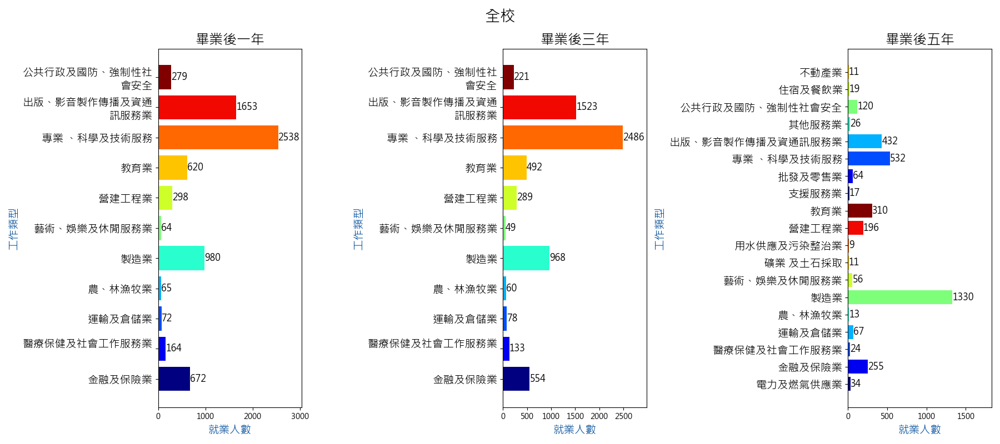
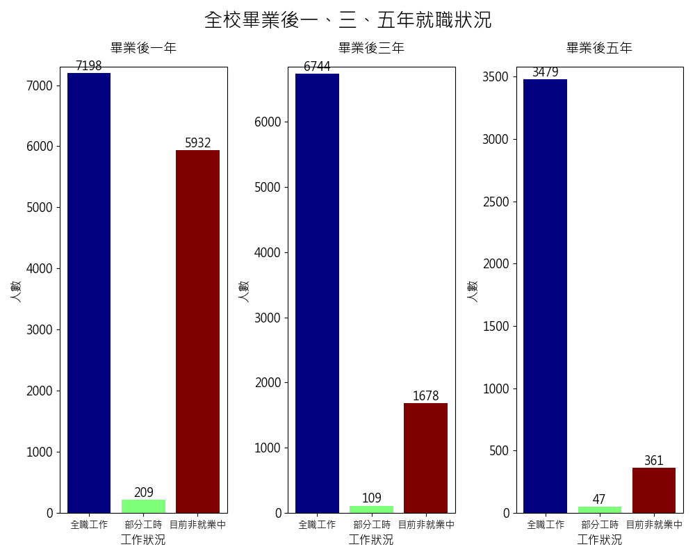
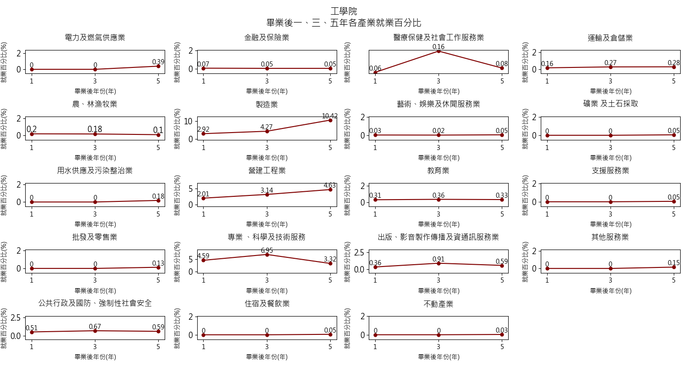

# Analysis of NCU Alumni Employment in Competitive Industries

A comprehensive data analysis project that examines employment trends for National Central University (NCU) alumni at one, three, and five years after graduation. This project identifies the most competitive and high-employment industries among different colleges and departments, providing valuable insights for both the university and prospective students.

## 🎯 Project Overview

This project analyzes graduate employment data from NCU to understand:
- Employment patterns across different time periods (1, 3, 5 years post-graduation)
- Industry distribution by college and department
- Employment status trends (full-time, part-time, unemployed)
- Competitive industries for NCU alumni

## 🛠️ Tech Stack

- **Python 3.x** - Core programming language
- **Pandas** - Data manipulation and analysis
- **Matplotlib** - Data visualization and chart generation
- **NumPy** - Numerical computing
- **CSV Processing** - Data input/output handling

## 📋 Prerequisites

- Python 3.6 or higher
- Required Python packages (install via pip):

```bash
pip install pandas matplotlib numpy
```

## 🚀 Setup & Installation

1. **Clone the repository:**
   ```bash
   git clone <repository-url>
   cd NCU-SchoolContest
   ```

2. **Install dependencies:**
   ```bash
   pip install pandas matplotlib numpy
   ```

3. **Prepare your data:**
   - Place your CSV data files in the `dataset/` directory:
     - `first.csv` - 1-year post-graduation data
     - `third.csv` - 3-year post-graduation data  
     - `fifth.csv` - 5-year post-graduation data

4. **Run the analysis:**
   ```bash
   python main.py
   ```

## 📊 Key Findings

### Overall Employment Trends
- **Top Industry**: Professional, Scientific, and Technical Services (2,538 alumni)
- **Second**: Publishing, Audiovisual, and Information & Communications (1,653 alumni)

### College-Specific Insights (1 Year Post-Graduation)
- **College of Electrical Engineering & Computer Science**: Dominated by Information & Communications (818 people)
- **College of Science**: Professional, Scientific, and Technical Services (394 people)
- **College of Engineering**: Professional, Scientific, and Technical Services (612 people)
- **College of Management**: Professional, Scientific, and Technical Services (613 people)
- **College of Liberal Arts**: Education sector (242 people)
- **College of Earth Sciences**: Professional, Scientific, and Technical Services (263 people)

### Employment Status Distribution
- Most alumni work full-time across all time periods
- Part-time employment and unemployment rates vary by college and time period

## 📁 Project Structure

```
NCU-SchoolContest/
├── dataset/                          # Raw data files
│   ├── first.csv                     # 1-year post-graduation data
│   ├── third.csv                     # 3-year post-graduation data
│   ├── fifth.csv                     # 5-year post-graduation data
│   └── 畢業生流向問卷.xlsx           # Original survey data
├── main.py                           # Main analysis script
├── output.txt                        # Analysis results output
├── poster/                           # Research poster materials
│   ├── Screenshot 2025-03-12 at 16.07.39.png
│   └── 校務研究海報競賽_hellonihaoma_分析中大校友具高競爭力的產業類別.pdf
├── PPT/                              # Presentation materials
│   ├── 校務研究海報競賽_hellonihaoma_分析中大校友具高競爭力的產業類別.pdf
│   └── 校務研究海報競賽_hellonihaoma_分析中大校友具高競爭力的產業類別.pptx
├── 全校一三五年就業類別/             # University-wide employment by industry
├── 全校就職情況/                     # University-wide employment status
├── 全校畢業就業/                     # University-wide graduation employment
├── 各學院一三五年就業類別/           # College-specific employment by industry
├── 各學院就職狀況/                   # College-specific employment status
├── 各學院畢業就業/                   # College-specific graduation employment
└── 各系畢業就業/                     # Department-specific employment data
    ├── 地球科學學院/
    ├── 太空及遙測研究中心/
    ├── 客家學院/
    ├── 工學院/
    ├── 文學院/
    ├── 理學院/
    ├── 生醫理工學院/
    ├── 管理學院/
    └── 資訊電機學院/
```

## 📈 Sample Visualizations

### University-wide Employment Trends


### Employment Status Distribution


### College-specific Analysis


## 🎨 Research Poster


[📄 View Full PDF Poster](./poster/校務研究海報競賽_hellonihaoma_分析中大校友具高競爭力的產業類別.pdf)

## 🔧 Usage

The main script (`main.py`) performs comprehensive analysis including:

1. **Data Processing**: Cleans and standardizes employment data
2. **Industry Classification**: Maps job categories to standardized industry codes
3. **Visualization Generation**: Creates charts for all colleges and departments
4. **Statistical Analysis**: Calculates employment percentages and trends
5. **Report Generation**: Outputs detailed results to `output.txt`

### Key Functions:
- `getCollegeWorkTypeData()` - Analyzes employment by industry for specific colleges
- `plotWorkTypeTotal()` - Generates comparative charts across time periods
- `plotInJobTotal()` - Creates employment status visualizations
- `getMajorWorkTypeData()` - Department-level analysis

## 📊 Output Files

The analysis generates:
- **Visualizations**: PNG charts for each college and department
- **Data Report**: Detailed statistics in `output.txt`
- **Comparative Analysis**: Multi-year trend charts
- **Employment Status**: Full-time, part-time, and unemployment breakdowns

## 🎓 Academic Context

This project was developed for the NCU Institutional Research Poster Competition, focusing on identifying high-competitiveness industries for NCU alumni. The analysis provides actionable insights for:
- University career services
- Prospective students choosing majors
- Alumni career development
- Industry partnership opportunities

## 📝 Data Sources

- NCU Graduate Employment Survey Data
- Alumni tracking surveys (1, 3, 5 years post-graduation)
- Industry classification standards
- Employment status tracking

## 🤝 Contributing

This is an academic research project. For questions or collaboration opportunities, please contact the research team.

## 📄 License

This project is developed for academic research purposes at National Central University.

---

*Last updated: March 2025*